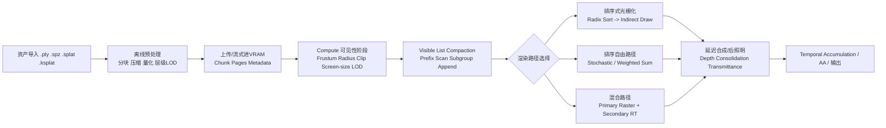

# 高斯溅射实时渲染器实现路线与大场景性能优化研究

## 执行摘要

在当前时间点，如果把目标限定为 **PC 端独立显卡、1920×1080、60 FPS、平均可见 100k Gaussian splats、目标 GPU 为 RTX 30/40 或 RDNA2/3**，那么工程上最稳妥、风险最低、也最容易达到“持续流畅”的主线方案，仍然是 **以光栅化为核心的 GPU-driven 管线**：先做可见性筛选与压缩、仅对可见 splat 进行排序或局部排序、再用 **实例化/mesh shader/compute 辅助光栅化** 输出，并在需要时叠加 **LOD、流式加载、可变分辨率、延迟合成**。原始 3DGS 的优势是“高质量 + 高速可见性渲染”，官方实现和后续 Vulkan/CUDA 开源项目都基本沿着这条主线演进；真正决定是否能在大场景中持续流畅的，不是“总高斯数”本身，而是 **可见高斯数、平均屏幕覆盖面积、overdraw、排序成本、缓存局部性、混合/ROP 压力、以及 CPU-GPU 同步方式**。citeturn27view0turn35search8turn6view0turn13view4

过去两年里，路线明显分化成几类。其一是 **传统排序式光栅化**，依旧是桌面实时主力；其二是 **compute 主导的分块/批处理渲染**，越来越多用于跨平台和 Vulkan 化实现；其三是 **大场景导向的分层/连续 LOD 渲染**，代表性工作直接把“渲染预算控制”做成一等公民；其四是 **排序自由的 stochastic / weighted-sum 近似透明**，其核心价值是去掉全局排序这个结构性瓶颈；其五是 **高斯光线追踪与混合渲染**，解决次级光线、畸变相机、景深、阴影、反射/折射等传统 3DGS 难题，但纯 RT 路线通常帧率更低，因此实际更推荐 **主光线光栅化 + 次级光线 RT** 的混合架构。citeturn13view3turn13view2turn13view1turn13view0turn8view4

对“大场景 + 高数量高斯”的系统设计来说，必须重视的不是单点技巧，而是 **架构级特性**：**SoA/热冷分离数据布局、GPU 可见列表压缩、分层 LOD、仅可见排序、合批与间接绘制、bindless 资源访问、流式加载、必要时的压缩存储、以及对透明混合路径的专门设计**。在已有开源实现中，Hierarchical 3DGS 把 LOD 与大场景训练/渲染结合，CLOD-3DGS 则把连续 LOD、预算渲染、foveated rendering 和 VR 直接落成可运行的 Vulkan viewer；vkgs 与 3DGS.cpp 都在强调 **纯 GPU 任务驱动、无每帧 CPU 读回**；NVIDIA 的 `vk_gaussian_splatting` 则是目前最系统的“多路线实验场”，同一工程中同时提供 **光栅化、ray tracing、3DGUT、混合渲染、stochastic transparency、deferred lighting/shadow** 等路径。citeturn26view2turn32view0turn28view4turn36view2turn4view4turn7view8

从性能瓶颈上看，PC 独显环境中最常见的热点并不是单纯“算力不够”，而是：**随机访存引起的 L1/L2/VRAM 压力、排序与可见列表生成中的原子竞争、透明混合导致的 PROP/CROP/ROP 压力、分支/线程发散、render target 切换和 barrier、以及不必要的 CPU-GPU 同步**。NVIDIA Nsight Graphics 的 GPU Trace / Shader Profiler 和 AMD RGP / RMV 对这些问题都有相当直接的观测入口：前者更适合看 **SM/L1TEX/L2/VRAM/RASTER/PROP/CROP** 的单位吞吐和 shader stall，后者更适合看 **wave occupancy、VGPR 压力、barrier、context roll、cache counters、内存占用与碎片**。citeturn22view0turn39search0turn39search3turn22view2turn22view3turn22view4turn25search8

**结论要点** 可以先浓缩为五条。第一，**桌面主线仍应优先选择排序式或局部排序式光栅化，而不是一开始就押纯 RT**；第二，**大场景要先做 LOD/层级与流式，再谈 shader 微优化**；第三，**100k 可见 splat 在现代独显上本身不夸张，真正危险的是“大 splat + 高重叠 + 全局排序 + 透明混合”**；第四，**descriptor indexing / bindless、buffer device address、subgroup、timeline semaphore、mesh shader、fragment shading rate、ray query** 这些 Vulkan 特性都能实打实改善工程效率或性能，但收益高度依赖你的瓶颈位置；第五，**最应避免的工程错误** 是每帧 CPU 读回、宽松边界导致的过度绘制、过粗的中心点剔除、错误的透明混合/排序假设，以及把 host-visible 内存当作主渲染存储。citeturn29view0turn29view1turn29view4turn29view2turn29view6turn29view3turn29view7turn6view0turn23search17

## 当前主要实现路线与对比

“高斯溅射实时渲染器”如今已经不是单一路线。更准确地说，它已经形成了几条各自有清晰边界、适用场景和风险模型的实现谱系。

| 路线 | 代表工作/实现 | 原理 | 主要优点 | 主要短板 | 适用场景 | 复杂度 | 内存与带宽画像 |
|---|---|---|---|---|---|---|---|
| 排序式光栅化 | 原始 3DGS、SIBR viewer、`vk_gaussian_splatting` 的 vertex/mesh 路线、`vkgs` citeturn27view0turn6view0turn28view4 | 每帧做可见性与深度排序，再把每个 Gaussian 投影成屏幕空间椭圆或其包围 quad，按顺序 alpha compositing | 质量稳定，和传统图形管线兼容性好；在桌面 GPU 上仍是最成熟主线 | 全局排序成本高；大 splat/高重叠时 overdraw 与混合开销重；透明排序误差会导致 popping | PC 桌面实时 viewer、编辑器、离线预览 | 中 | 排序与属性读取是 per-splat 成本；混合/ROP 是 per-fragment 成本，画面重叠越高越吃带宽 citeturn6view0turn0search1 |
| Compute 主导的分块/批处理渲染 | `diff-gaussian-rasterization`、`gsplat`、`3DGS.cpp`、`VkSplat` citeturn26view5turn12view1turn36view2turn31academia20 | 用 compute 完成投影、culling、packing、tile/bin 构建、排序或软件式 raster 辅助，再进入 draw 或直接写目标 | 跨平台可控性更高；容易把 visible-list 压缩、prefix-sum、subgroup、indirect dispatch 全纳入一个 GPU-driven 系统；适合大场景 | 实现复杂；非常依赖前缀和、原子、cache 局部性；调试成本高 | Vulkan/CUDA 原生渲染器，大场景训练/渲染统一栈 | 高 | 如果 visible-list 做得好，显著减少“无效高斯”流量；否则很容易被随机访存与原子拖死 citeturn15search1turn15search2turn31search5 |
| 纹理/贴图式属性组织与压缩合成 | Self-Organizing Gaussian Grids、Web viewer/压缩格式工具链、SuperSplat、GaussianSplats3D citeturn13view5turn26view4turn28view7 | 把高斯属性重排成更规整的 2D grid / 压缩纹理 / web 友好格式，由 shader 按索引采样 | 适合发布、流式与 Web；显著减小模型体积；改善 I/O 与缓存友好性 | 更偏资产与数据组织层，未必直接解决混合与排序瓶颈；解码/重建有成本 | Web、移动端、在线分发、极大模型下载 | 中 | 对磁盘与网络收益最大；对 VRAM 与 cache 也有帮助，但要配合运行时压缩/分页策略才明显 citeturn12view3turn13view5 |
| 排序自由近似透明 | Weighted Sum Rendering、StochasticSplats、NVIDIA Stochastic Transparency citeturn13view2turn13view3turn34view5 | 把严格的 back-to-front alpha blend 替换成 weighted sum 或 stochastic estimator，以去掉全局排序 | 去掉结构性排序瓶颈；更容易做质量-性能旋钮；可减轻 popping | 可能引入噪声或近似误差；高不透明重叠、时间稳定性、收敛速度需要额外处理 | 交互优先、移动/Web、VR、探索性渲染 | 中到高 | 理论上减少排序读写与同步；但会引入样本累积、额外历史缓冲或统计噪声处理 citeturn13view2turn34view5turn34view6 |
| 高斯光线追踪 | 3DGRT、`vk_gaussian_splatting` 的 VK3DGRT、`3dgrut` citeturn13view1turn26view1turn7view3 | 为高斯建立加速结构，逐像素追踪粒子相交与透明累积 | 原生支持次级光线、反射、折射、阴影、复杂相机模型 | 纯 RT 路线通常显著慢于 raster；AS 构建/更新和 overlap 很容易变成瓶颈 | 需要复杂镜头模型、次级光线、与 mesh 深度耦合的高端路径 | 高 | 对 RT hardware、AS 构建策略、TLAS/BLAS 组织极敏感；重叠大的 AABB 非常危险 citeturn8view1turn8view2 |
| 混合渲染 | 3DGUT、VK3DGHR、3DGS/3DGRT 与 3DGUT/3DGRT 混合 citeturn13view0turn8view4 | 主光线继续走高效 raster，次级光线或特殊相机效果交给 RT | 兼顾实时性与高级效果，是当前高端 PC 上最均衡的“扩展路线” | 管线复杂，数据互通与一致性处理麻烦 | 要在实时 viewer 中引入反射、折射、景深、fisheye 等 | 高 | 主路径仍受 raster/排序影响；次级路径受 RT/AS 影响，但总成本明显低于纯 RT citeturn8view4turn8view5 |

如果从“今天应该怎么做”来判断，**排序式光栅化** 依然是桌面主流，因为它在质量、成熟度、可维护性和工具链支持上最均衡。NVIDIA 的 Vulkan sample 直接把这一路线做成了两种图形路径：**vertex shader pipeline** 与 **mesh shader pipeline**；官方文档甚至明确写到，若用 geometry shader 生成 quads，性能通常不如 mesh shader。citeturn7view1

但如果问题不是“能跑”，而是“**在更大、更复杂、更跨平台的大场景里仍然跑得稳**”，那么答案会明显转向 **compute 主导 + GPU-driven + 层级化**。`gsplat` 强调 packed/sparse_grad/batch/distributed rasterization，`vkgs` 强调 “100% GPU tasks、无单帧 CPU-GPU 同步、仅排序可见点并 indirect sort & draw”，`3DGS.cpp` 甚至把 Vulkan subgroups 视为逼近 CUDA warp-level 优化的关键。citeturn15search1turn15search2turn28view4turn36view2

排序自由路线已经不能再视作“边缘研究”。Weighted Sum Rendering 在移动 GPU 上报告了平均 **1.23×** 的渲染加速；StochasticSplats 则给出更激进的结论：在合理视觉质量下，可以比排序式 rasterization **快 4 倍以上**，而且还指出了一个很反直觉的事实——**把分辨率调低，并不一定更快**，因为传统排序式 3DGS 的很多成本并不随像素数线性下降。citeturn13view2turn13view3

至于 RT 与混合方法，结论也很明确：**纯 RT 不是大多数实时 viewer 的默认选项，但混合管线非常值得做**。在 NVIDIA 的样例里，Hybrid 3DGUT/3DGRT 的示例场景从 **47 FPS 提升到 110 FPS**，Hybrid 3DGS/3DGRT 的示例从 **54 FPS 提升到 199 FPS**；这不是一般性的“普适数值”，但足以说明在主光线继续光栅化的前提下，引入 RT 做特定任务是很有工程价值的。citeturn8view4turn8view6

## 现有开源高斯实时渲染器实现盘点

下表挑的是我认为**最值得直接读代码**的一批项目，它们基本覆盖了桌面、Vulkan、CUDA、Web、排序自由、LOD/VR、以及 RT/Hybrid 这些主线分支。

| 项目 | API / 平台 | 主要路线 | 关键特征 | 对大场景/高数量的启示 |
|---|---|---|---|---|
| `graphdeco-inria/gaussian-splatting` | PyTorch + CUDA + OpenGL/SIBR | 原始 3DGS 参考实现 | 代码含优化器、网络 viewer、OpenGL 实时 viewer，官方目标是 1080p 实时显示；viewer 需求 OpenGL 4.5、推荐 4GB VRAM citeturn27view0 | 适合作为“正确性基线”和数据格式基线，但不应直接当最终工程架构 |
| `graphdeco-inria/diff-gaussian-rasterization` | CUDA | Compute/CUDA raster backend | 原始论文配套的微分高斯光栅后端 citeturn26view5 | 适合研究 tile/bin/排序/可见列表的最核心后端逻辑 |
| `nerfstudio-project/gsplat` | CUDA + Python | 高性能 CUDA rasterization | JMLR 论文给出“最多 4× 更低训练内存、最多 10% 更短训练时间”；文档进一步提供 packed、sparse gradients、batch、distributed rasterization、large-scene support citeturn14view0turn15search2turn15search5 | “只处理当前 camera 看到的稀疏子集”这件事，在大场景里非常关键 |
| `nvpro-samples/vk_gaussian_splatting` | Vulkan | 多路线实验场 | 同时提供 raster、mesh shader、ray tracing、3DGUT、hybrid、stochastic transparency、lighting/shadows；2025–2026 版还加入 centralized bindless asset management、多实例 splat set 架构、global index tables、GPU-built particle AS 与 multi-TLAS/multi-BLAS chunking、VRAM budget pre-checking citeturn4view3turn4view4turn7view8 | 这是目前最适合做“桌面生产级架构对比”的开源样本 |
| `nv-tlabs/3dgrut` | CUDA / RTX | RT + 3DGUT + Hybrid | 官方实现 3DGRT/3DGUT，明确指出 3DGRT 支持 distorted cameras 与 secondaries，但更慢；3DGUT 保持 raster 效率，再与 RT 对齐形成混合方法 citeturn26view1turn13view0 | 若你的产品目标需要镜头模型/反射/折射/阴影，这是最直接的代码入口 |
| `jaesung-cs/vkgs` | Vulkan | GPU-driven 排序式光栅化 | 目标是最大化渲染速度；强调 **100% GPU tasks**、**无单帧 CPU-GPU 同步**、**只排序可见点**、**indirect sort & draw**；README 给出 4090 上 1600×900 350+ FPS 的示例结果 citeturn28view4 | “sort only visible splats + 全 GPU 驱动” 是非常实用的工程原则 |
| `shg8/3DGS.cpp` | Vulkan Compute，Windows/Linux/macOS/iOS/visionOS | 纯 Vulkan compute | 目标是摆脱 CUDA 绑定；README 明确把 Vulkan compute + subgroups 视作接近 CUDA warp primitives 的跨平台替代，并把“实现 SOTA 并行 radix sort / 用 subgroup 批量抓取 Gaussian”列为后续重点 citeturn36view2 | 如果你要跨 NVIDIA/AMD/Apple 做统一栈，这个项目的思路很有参考价值 |
| `facebookresearch/CLOD-3DGS` | Vulkan | 连续 LOD / 预算渲染 | 支持 traditional 3DGS + CLOD、budget-based rendering、stage profiler、foveated rendering、OpenXR VR；并给出动态分辨率/最大 splat 上限等控制 citeturn32view0 | 大场景想稳定帧率，**预算驱动 + 连续 LOD** 比“原始 3DGS 直接硬怼”更靠谱 |
| `ubc-vision/stochasticsplats` | OpenGL / Desktop / VR | 排序自由 stochastic rasterization | 基于 Splatapult 扩展，支持桌面和 VR；直接给出 `AB | ST | ST-popfree` 等模式 citeturn26view0 | 排序自由不再只是论文，已经有可运行 viewer |
| `antimatter15/splat` | WebGL | 轻量 Web viewer | 作者直说 CPU 对 ~1M splats 排序约需 **150ms**，并讨论 bitonic/radix、depth peeling、weighted blended OIT 等 Web 端可能性与局限 citeturn28view6 | Web/轻客户端最先遇到的不是算力上限，而是排序与 API 能力限制 |
| `mkkellogg/GaussianSplats3D` | Three.js / WebXR | Web 渲染与发布 | 支持 `.ply/.splat/.ksplat`、与 Three.js scene 混合、内建 WebXR citeturn28view7 | Web 分发常常更需要格式与工具链，而不是极致 FPS |
| `playcanvas/supersplat` | Browser editor | 资产优化/发布 | 这是一个开源、浏览器内运行的 splat editor，可用于 inspect/edit/optimize/publish 3D Gaussian Splats citeturn26view4 | 大场景上线前，离线优化与格式组织往往和运行时同样重要 |

这批开源实现给出的共同经验非常一致：如果你要在 PC 独显上把“大场景 + 很多高斯”做稳，**最佳实践不是一套“花哨 shader 技巧”，而是一条完整的数据生命周期**：资产重排与压缩、块化/层级化组织、GPU-driven 可见性和排序、少同步、少切换、再加上必要时的混合/RT 增强。citeturn26view2turn32view0turn28view4turn4view3

## 面向高数量大场景的架构特性与性能模型

先给结论：对你的目标参数而言，**“单帧平均可见 100k”并不天然可怕**。真正让帧时间失控的，是这些 splat 的 **平均屏幕覆盖面积** 和 **重叠结构**。因此架构设计的第一原则，不是“如何把所有高斯都画出来”，而是“如何尽量早、尽量便宜地证明它们不需要被画，或者不需要以最高精度被画”。这也是 Hierarchical 3DGS、CLOD-3DGS、gsplat packed mode、vkgs visible-only sorting 之所以在工程上有含金量的原因。citeturn13view4turn32view0turn15search1turn28view4



### 必须采纳或强烈推荐的架构特性

| 特性 | 必须/推荐 | 实现要点 | 典型性能影响 | 主要代价与注意事项 |
|---|---|---|---|---|
| **SoA 数据布局 + 热冷分离** | 必须 | 位置/尺度/旋转/opacity/低阶颜色放“热数据”，高阶 SH、编辑属性、调试字段放“冷数据”；优先 SSBO 或通过 BDA 访问的大缓冲；Web/压缩发布可转为纹理网格/压缩页 citeturn29view1turn13view5 | 减少无关字段被一起拉入 cache；对 L1/L2 miss 和内存带宽最直接 | 需要自定义序列化格式与版本管理 |
| **可见列表压缩** | 必须 | 先 cull，再把可见 splat 紧缩成 dense visible list，仅对其排序/绘制；`gsplat packed=True` 的思路可直接借鉴 citeturn15search1turn15search8turn28view4 | 对大场景通常是 **线性级** 收益：后续排序、投影、合批全部只处理可见集 | 需要 prefix-sum/atomic 管线，且要小心竞争 |
| **层级 LOD / 连续 LOD / 预算渲染** | 必须 | 户外、街景、园区级场景应默认采用层级或连续 LOD；Hierarchical 3DGS 提供层级与平滑过渡，CLOD-3DGS 进一步把预算渲染做成运行时控制 citeturn13view4turn32view0 | 往往是 **最大头的收益来源**，可把远景可见高斯数和排序成本压到原来的 20%–50% 甚至更低 | 需要额外训练/预处理，且要处理 LOD 切换一致性 |
| **剔除分层化** | 必须 | 至少做 frustum + radius_clip + screen-space size；再高一级可加 mesh depth 预裁剪、tile coverage rejection；NVIDIA 文档提醒“按中心点裁剪”会误剔大 splat，需 dilation 或更细规则 citeturn6view0 | 近乎零争议的收益；常见能削掉 10%–70% 的无效 splat | 粗糙剔除会引入 popping |
| **GPU-driven 合批与间接绘制** | 必须 | 把 visible count、group count 写进 indirect parameter buffer；后续 direct/mesh draw/dispatch 全走 indirect；避免 CPU 每帧读回 citeturn6view0turn28view4 | 对 CPU 开销和同步点非常有效；多 camera/VR 尤其关键 | 需要把调试习惯完全 GPU 化 |
| **排序只作用于可见集，且优先 GPU 排序** | 推荐 | GPU radix sort 是当前最稳的桌面路线；NVIDIA sample 明确给出 GPU radix sort 与 CPU async sort 两种方案，后者只是低端 fallback，且不做 cull 会有视觉代价 citeturn6view0 | 减轻 CPU 瓶颈；避免频繁 CPU/driver 参与 | 仍然是显著成本，尤其在视点频繁变化下 |
| **延迟合成 / 深度整合 / 后照明** | 推荐 | NVIDIA 的 raster lighting 管线把 shading 放到 deferred pass；混合模式中还能把 raster pass 输出的 color/transmittance 送入后续 RT 初始化 citeturn7view8turn8view4 | 当片元着色或灯光复杂时明显减负；也便于与 mesh 组合 | 需要更多 render targets，增加带宽与格式管理复杂度 |
| **可变分辨率 / Foveated / VRS** | 推荐 | 适合 VR、桌面编辑器和重 shading pass；CLOD-3DGS 已开源落地 foveated rendering，Vulkan 端是 `VK_KHR_fragment_shading_rate` citeturn32view0turn29view3 | 对 deferred shading / 复杂 fragment path 常有显著收益；对纯 blend-limited 路径收益较小 | 不能指望 VRS 神奇解决 ROP/混合瓶颈 |
| **流式加载与压缩表示** | 推荐 | 层级分页、chunk-based upload、磁盘到 VRAM 流式；Self-Organizing Gaussian Grids 给出 17×–42× 压缩，Hierarchical 3DGS 已有按需流向 GPU 的设计 citeturn13view5turn26view2 | 对启动时间、显存占用、PCIe 与磁盘 I/O 很重要 | 解码与页管理会引入新同步问题 |
| **bindless / 大描述符池 / 指针化访问** | 推荐 | descriptor indexing 或 descriptor buffer/BDA 把资源访问从“频繁绑定”变成“索引或指针访问” citeturn29view0turn37view2turn29view1 | 减少 CPU 绑定开销；更适合 chunk/page 体系与多场景实例化 | 需要更严格的资源生命周期管理 |

### 一个够用的性能估算模型

对桌面高斯渲染器，一个实用的一阶模型是：

\[
F \approx \sum_{i=1}^{N_v} a_i
\]

其中 \(N_v\) 是可见高斯数，\(a_i\) 是单个 splat 的屏幕覆盖片元数，\(F\) 就是总片元工作量。随后把总帧时间分拆为：

\[
T_{frame} \approx T_{cull} + T_{project} + T_{sort} + T_{raster}(F) + T_{post} + T_{sync}
\]

如果你只想先看带宽下界，可以写成：

\[
BW_{lower} \approx N_v(B_{attr}+B_{sort}+B_{cull}) + F \cdot B_{frag}
\]

这里 \(B_{attr}\) 是每个可见 splat 需要拉取的热属性字节数，\(B_{sort}\) 是排序读写成本，\(B_{frag}\) 是每个贡献片元的读-改-写/混合近似成本。实际观测到的流量通常还会再乘一个 **cache amplification 系数** \(\eta\)，因为排序后索引访问打散、render target 读改写、以及多附件写入都会放大真实流量。下面这个表不是硬件真值，而是 **用于做架构选型的工程级下界估算**。

在一个便于讨论的假设下：  
- \(N_v = 100k\)  
- 热属性 \(B_{attr}=64B\)  
- radix sort 平均等效 \(B_{sort}=80B\)  
- 单目标近似混合 \(B_{frag}=16B\)  
- \(\eta=2.5\) 作为较保守的“真实放大系数”  

则有：

| 场景假设 | 平均覆盖 \(\bar a\) | 理论下界流量/帧 | 60 FPS 的有效带宽估计 |
|---|---:|---:|---:|
| 小 splat、低重叠 | 8 px | 27.2 MB | 约 4.1 GB/s |
| 中等 splat、常见室内/近景 | 32 px | 65.6 MB | 约 9.8 GB/s |
| 大 splat、高重叠 | 128 px | 219.2 MB | 约 32.9 GB/s |

这个模型最重要的启示不是“数字本身”，而是：**片元覆盖面积的增长，比高斯数量增长更容易把系统拖入混合/ROP/缓存瓶颈**。因此当你发现“visible splat 数并不高，但帧时间仍在爆炸”时，第一怀疑对象应当是 **大 splat、宽 bounding box、无效片元、透明 overdraw**，而不是继续优化排序常数项。这个判断也与 3DGUT 文档里 “更紧的投影 extent 可以减少零贡献片元” 的经验一致。citeturn34view3

### 不同策略下的预期差异

继续用上面的同一组假设，可以给一个说明问题的对比：

| 策略 | 假设 | 理论下界流量/帧 | 工程解读 |
|---|---|---:|---|
| 基线：全局排序式 raster | \(N_v=100k,\ \bar a=32\) | 65.6 MB | 当前桌面主线；稳定但排序与混合都会吃时间 |
| 排序自由 stochastic / weighted | 去掉全局排序项 | 57.6 MB | 从纯带宽角度看只省掉排序读写，但真实收益经常 **大于** 这点，因为还少了同步和排序延迟；论文结果通常比这个模型更乐观 citeturn13view2turn13view3 |
| CLOD/层级 + 预算渲染 | \(N_v=40k,\ \bar a=20\) | 18.6 MB | 这是大场景里最值得优先做的方向，收益通常压倒纯 shader 微调 |
| CLOD + 排序自由 | \(N_v=40k,\ \bar a=20\), 无全局排序 | 15.4 MB | 代表“未来最有希望”的大场景实时组合，但画质与稳定性要单独验证 |

如果必须给一句工程判断，那么是：**对“大场景 + 高数量高斯”，LOD/层级/预算控制通常是第一收益源；去排序是第二收益源；其余 Vulkan/微架构技巧大多是乘法项。**

### 关键伪代码

下面这段伪代码对应的是我最推荐的“桌面主线版”——**GPU-driven visible-list + subgroup append + GPU sort + indirect draw**。其中 subgroup append 的写法本身也正好说明为什么 `subgroupBallot / subgroupElect / subgroupBroadcast` 对这一类渲染器很有用。Khronos 的文档还专门提醒：如果需要 subgroup 级别的 reconvergence 语义，要注意 `VK_KHR_shader_subgroup_uniform_control_flow` 的约束。citeturn29view4turn37view0

```cpp
// Frame N
beginFrame();

updateCameraUBO();
resetIndirectParams();          // instanceCount = 0, groupCount = 0

dispatch CullProjectPack:
for each gaussian g in parallel:
    proj = projectGaussian(g)
    if !insideFrustumApprox(proj, dilation): return
    if proj.radius < radiusClip: return
    lod = selectLOD(g, proj, budget)
    if lod == DISCARD: return

    // subgroup-aggregated append
    mask  = subgroupBallot(true)
    count = subgroupBallotBitCount(mask)

    if subgroupElect():
        base = atomicAdd(visibleCounter, count)

    base = subgroupBroadcastFirst(base)
    slot = base + subgroupExclusiveAdd(1)

    visibleList[slot] = g.index_or_page_ptr
    depthKeys[slot]   = encodeDepthKey(proj.depth)
    updateIndirectParams(slot)

barrier();

if (renderMode == SORTED_RASTER):
    radixSort(depthKeys, visibleList);   // visible-only
    barrier();
    drawIndirectMeshOrInstancedQuad(visibleList, indirectParams);

else if (renderMode == STOCHASTIC):
    drawUnsortedWithStochasticVisibility(visibleList, indirectParams);
    temporalAccumulate();

if (lightingMode == DEFERRED):
    dispatchDeferredLighting();

if (hybridRT):
    traceSecondaryRaysUsingRasterOutputs();

present();
```

如果你需要排序自由版本，运行时的关键不是“把排序去掉就结束了”，而是 **接受 stochastic/近似透明的统计语义**：

```cpp
for each candidate fragment f:
    p = opacity_to_probability(f.alpha)
    if hash(pixel, frame, splatId) < p:
        // treat accepted event as opaque sample
        depthTestAndWrite(f.depth)
        accumulateSample(f.color)

history[pixel] = temporalBlend(history[pixel], currentSample)
```

这就是为什么 stochastic 路线常常把 **MSAA、时间累积、历史格式精度** 一起带进来；NVIDIA 的样例甚至明确提醒：当时间累积帧数超过约 150–200 帧时，可能需要把输出从 FP16 切到 FP32，而当不做 temporal accumulation 时，切到 UINT8 会更快。citeturn34view5

## PC 独立显卡常见瓶颈、检测方法与优化建议

NVIDIA 和 AMD 的 profiling 视角有差异，但本质上都在回答同一件事：**你的时间到底花在 shader、memory、ROP、barrier，还是 CPU/GPU 关系上。**

| 瓶颈 | 在高斯渲染里的典型来源 | 怎么看 | 优化建议 |
|---|---|---|---|
| **VRAM/L2/L1TEX 带宽压力** | 大量随机属性读取、排序 scratch、多个 RT、SH 或冷数据误读入 cache | Nsight GPU Trace 的 **L1TEX / L2 / VRAM** 单元吞吐；RGP 的 memory-related counters / cache counters citeturn39search0turn22view2turn21search19 | SoA、热冷分离、FP16/量化、降低 SH 阶数、按 chunk 重排、压缩页 |
| **Cache miss 与局部性差** | sort 后按索引回表、chunk 过散、不同 splat 页面来回跳 | RGP cache counters、Nsight 中 cache throughput 异常高但 SM 实效不高 citeturn21search19turn39search3 | chunk 内连续存储、Morton/空间重排、visible-list 先压紧再读属性 |
| **分支/线程发散** | 剔除分支、LOD 分支、随机接受/拒绝、不同 splat 尺寸导致工作不均 | Nsight Warp Info 里 inactive threads due to divergence；Shader Profiler 的 stall/hotspot；RGP occupancy 波动 citeturn39search4turn39search3turn22view4 | 用 subgroup-uniform 流程、按 splat 尺寸/模式分桶、不同阶段拆不同 kernel |
| **原子竞争** | visible append、tile list、直方图、排序辅助数据 | Shader Profiler 热点、RGP pipeline stalls、dispatch 末尾 occupancy 掉得异常；Vk subgroup uniform control flow 示例正是“从每线程一个 atomic 变成每 subgroup 一个 atomic” citeturn37view0turn22view2 | subgroup 聚合、prefix-sum compaction、局部 shared/LDS 累积后再全局写 |
| **ROP/混合/透明路径饱和** | 大 splat、高重叠、早深度失效、多个 color/depth/aux 附件 | Nsight 的 **RASTER / PROP / ZROP / CROP** 区域高；PROP 管理 Early-Z/Late-Z 与 blending citeturn39search0 | 缩紧投影范围、front-to-back + transmittance threshold、剔除被 mesh 遮挡的粒子、必要时尝试 stochastic/weighted 路线 |
| **Render target 切换与状态 churn** | 多 pass、多格式切换、频繁改 pipeline / descriptor 状态 | RGP 的 **context rolls**；RGP 文档明确指出 ineffective draw batching 可导致 context roll 增多 citeturn22view3 | 合批、按 pass/材质/格式排序，减少 pipeline 和 RT 变更，能合并的 pass 就别拆 |
| **同步点与 GPU 空转** | CPU 等 visible count、CPU 排序、barrier 过多、graphics/compute 串行 | Nsight GPU Trace 看同步对象与队列执行，Nsight Systems 看 CPU/GPU gaps；RGP 看 barriers 与事件时间 citeturn22view0turn23search4turn22view2 | 不做每帧 CPU 读回；优先 indirect draw/dispatch；用 timeline semaphores；尝试 async compute |
| **PCIe 传输与 host-visible 误用** | 每帧上传太多 chunk、把主渲染数据留在 HOST_VISIBLE | Nsight Systems 看 memory transfers / CPU-GPU 关系；Khronos 的 Vulkan memory 资料强调 host-visible 系统内存对 GPU 访问会慢、经 PCIe citeturn23search4turn23search17 | staging 上传一次后落 DEVICE_LOCAL；用环形 staging；压缩页异步上传；别把大 SSBO 常驻 host-visible |
| **寄存器压力 / occupancy 低** | 投影、SH、复杂 fragment/RT shader 导致 VGPR 暴涨 | RGP Occupancy 视图与 device config 可直接看理论 occupancy 与 VGPR 限制 citeturn22view4 | 拆 shader、避免大 struct 复制、减少 live-range、分阶段求值 |
| **内存碎片与分配器问题** | 大量 chunk/page 生灭、流式加载/卸载 | RMV 查看 heap/snapshot，VMA 提供 defragmentation、线性池、统计与虚拟分配器 citeturn25search8turn24view0 | 用 VMA、环形/线性池、页化分配、低频做 defrag，不要自己零散 `vkAllocateMemory` |

有两条 profiling 经验尤其值得强调。

第一，**先用系统级/帧级工具定位，再进 shader profiler**。Nsight Graphics 明说 GPU Trace 适合找 throughput bottlenecks、同步对象与异步计算机会；RGP 则强调它可以分析 async compute、event timing、pipeline stalls、barriers、bottlenecks。也就是说，如果你先钻进 shader 源码，而没搞清楚自己其实是在等 barrier 或被 ROP 卡住，通常会浪费很多时间。citeturn22view0turn22view2

第二，**看 occupancy 时不要只看“高不高”，要看为什么不高**。AMD 的 Occupancy 文章给了很好的工程解释：occupancy 可能是被 VGPR 压力限制，也可能只是“工作量不够把 GPU 填满”，还可能是 barrier 让 dispatch 之间无法重叠。对高斯渲染器而言，这意味着“把一个超大 kernel 再写复杂一点”未必正确；很多时候更好的办法是 **把阶段拆开、用更规整的工作粒度、减少每线程 live state**。citeturn22view4

## 常见坑与工程实践建议

### 透明排序、popping 与错误的深度假设

这是所有高斯渲染器最容易踩的第一坑。标准 3DGS 及其大量实现，默认都依赖某种 **view-dependent 排序 + alpha compositing**。问题在于，很多实现用的实际上是简化深度 key，例如中心点深度、近似 extent 或粗粒度 tile 顺序，这些近似在穿插结构、长条 splat、或镜头快速移动时就会出现 **顺序错误与 popping**。StopThePop 的研究正是针对这类排序/尺度伪影提出更稳定的排序与层次处理；NVIDIA 文档也明确说 CPU 异步排序是为了低端 fallback，但会出现能被接受的 popping，而不是严格正确。citeturn0search1turn6view0

### 过度绘制不是“次要问题”，它常常才是主问题

如果你的 bounding box 取法过松，大量片元其实对最终图像贡献接近零，但仍然完整走过 raster/fragment/混合路径。3DGUT 文档里专门比较了不同 extent 的做法，并指出更贴合粒子的非轴对齐 extent 能避免“渲染很多贡献极小或为零的 fragment”。这件事在“看上去只有 100k splats”的场景里也可以轻松把成本放大数倍。citeturn34view3

### 中心点剔除会误伤大 splat

这是大场景实现里非常常见的“看似正确、实则脆弱”的优化。NVIDIA 的 raster 文档明确说明：如果 frustum culling 只在 splat 中心做测试，那么大 splat 在视口边缘很可能被过早丢弃，于是你会得到明显的 popping。它提供了 frustum dilation 作为近似补救，但也明确承认这仍然只是近似。citeturn6view0

### 分辨率下降不一定更快

StochasticSplats 的摘要直接点出了这一点。对排序式 3DGS 来说，排序、可见列表和一部分投影工作并不随像素数量线性下降，因此“把分辨率砍半就一定更快”是错误直觉。如果你的瓶颈在排序、同步或 CPU/driver，而不是 fragment shading，那么降分辨率的收益会比预想得小得多。citeturn13view3

### RT 路线里，AABB 与 AS 组织方式会让性能从“能用”变成“device lost”

在 3DGRT / Vulkan sample 的文档里，一个非常具体且非常实用的坑是：**启用 AABB，同时又不使用 TLAS instances**，会导致 BLAS 中出现大规模 AABB overlap；性能会非常慢，甚至可能引发 device lost。相反，实例化后单个 AABB 再通过 instance transform 变成非轴对齐盒，情况要好得多。文档还提到 **BLAS compaction** 能进一步改善内存与追踪性能。citeturn8view1turn8view2

### 混合模式、颜色格式与累积精度不能“先随便写一个”

如果你引入 stochastic transparency、temporal accumulation 或 history-based denoise，那么颜色格式和混合规则变成一等公民。NVIDIA 样例明确提醒：时间累积超过约 150–200 帧时，FP16 可能不够；不做时间累积时，把颜色切到 UINT8 又会更快。这类问题如果处理不好，最后呈现出来的不是“性能稍差”，而是 **颜色漂移、积累发灰、历史残影、或者数值不稳定**。citeturn34view5

### 资源绑定与描述符管理很容易变成 CPU 热点

如果你还停留在“每块数据一个 descriptor set、每 pass 大量更新和绑定”的思路里，CPU 往往先死。Khronos 的 descriptor indexing 文档用很直白的话说：它把 descriptor memory 视作一个大数组，bindless 的核心是“绑定资源不再是主要问题”；而 descriptor buffer 则进一步把 `vkCreateDescriptorPool / vkAllocateDescriptorSets / vkUpdateDescriptorSets / vkCmdBindDescriptorSets` 这一整串老操作从主要路径里挪开。对 chunk/page 式高斯渲染器来说，这类改造的意义不是“API 更时髦”，而是 **让资源组织方式终于配得上数据驱动架构**。citeturn29view0turn37view2

### 工程实践建议

如果你的目标是“尽快做出能在 PC 独显上稳定跑的大场景渲染器”，最稳的做法是：

- 先做 **visible-list only** 的 GPU-driven 基线。
- 再做 **LOD / hierarchical budget**。
- 再处理 **descriptor/bindless/BDA**，把资源访问从绑定驱动改成索引/指针驱动。
- 最后才是 **mesh shader、VRS、stochastic、hybrid RT** 这些更有风险但也更有回报的增强项。citeturn28view4turn13view4turn32view0turn29view0turn29view1

## Vulkan 扩展、厂商特性与可利用的非通用加速路径

这部分我按“**是否建议优先接入**”来讲，而不是按扩展名罗列。

| 扩展/特性 | 建议级别 | 在高斯溅射中的典型用途 | 注意事项 |
|---|---|---|---|
| **`VK_EXT_descriptor_indexing` / bindless** | 优先接入 | 用一个大 descriptor 数组管理 chunk/page/texture/buffer，shader 通过索引选择高斯数据页，减少大量 descriptor bind 与 set churn citeturn29view0 | 要重做资源生命周期与越界保护 |
| **`VK_KHR_buffer_device_address`** | 优先接入 | 直接把高斯 page、visible list、metadata 以“GPU 指针”方式组织；适合大缓冲 + 自定义 allocator + BDA 索引跳转 citeturn29view1 | 需要更小心地址稳定性、对齐、capture/replay |
| **`VK_EXT_descriptor_buffer`** | 推荐 | 把 descriptor 放进可 GPU 直接读取的 buffer 中，降低传统 descriptor pool/set/update 的 CPU 负担 citeturn37view2turn37view1 | 需要处理实现相关的 size/alignment；生态仍比传统 set 更复杂 |
| **Subgroup 操作** | 优先接入 | subgroupBallot / subgroupElect / subgroup scan 可显著减少 visible append、tile binning、局部归约中的原子数 citeturn29view4turn37view0 | 必须理解 subgroup reconvergence 语义 |
| **`VK_EXT_subgroup_size_control`** | 推荐 | 在 AMD wave32 / NVIDIA warp32 / 其他宽度下控制 subgroup 大小，让 kernel 粒度和硬件更匹配 citeturn29view5 | 要做 capability query；不是所有 stage 都能固定 subgroup size |
| **`VK_KHR_shader_subgroup_uniform_control_flow`** | 推荐 | 保证 subgroup 级别统一控制流假设更稳，特别适合“每 subgroup 一个 atomic”这类模式 citeturn37view0 | 会束缚某些控制流写法，换来正确性与可预期性 |
| **`VK_EXT_mesh_shader`** | 推荐 | 每个工作组生成一批 splat quads，比传统 vertex/geometry 更适合 GPU-driven 组织；NVIDIA 样例已有直接实践 citeturn29view6turn7view1 | 并非所有平台/驱动都适合一开始就依赖；验证与 profiling 要跟上 |
| **`VK_KHR_fragment_shading_rate`** | 按需接入 | 用于 foveated rendering、外圈降采样、deferred lighting 或复杂 fragment 路径降 shader invocation 数 citeturn29view3 | 对纯 blend/ROP 限制的路径帮助有限 |
| **`VK_KHR_ray_query` / `VK_KHR_ray_tracing_pipeline` / `VK_KHR_acceleration_structure`** | 按产品目标接入 | mesh 遮挡、secondary rays、shadow/reflection/refraction、复杂镜头一致性；ray query 可从多种 shader 阶段发起追踪 citeturn29view7turn37view3 | 一旦接入，就要认真处理 AS 构建/更新/compaction/overlap |
| **Sparse Resources / Sparse Residency** | 大场景时考虑 | 做超大场景分页、部分驻留与 stream-in；适合 chunk/page 式巨大模型 citeturn29view8 | 实现复杂，平台差异和性能波动都比较大 |
| **`VK_KHR_timeline_semaphore`** | 推荐 | 把 cull/sort/draw/upload 做成现代 task graph，减少 binary semaphore + fence 的样板和同步错误 citeturn29view2 | 仍需小心 out-of-order submission |
| **`VK_KHR_cooperative_matrix` / `VK_NV_cooperative_matrix`** | 谨慎试验 | 可用于某些矩阵批处理、ML predictor（例如预算/LOD 预测器、后处理）等 compute 任务 citeturn29view9turn19search1 | 对主渲染路径不是一线收益，更多是边缘加速点 |
| **`VK_NV_cluster_acceleration_structure`** | 产品级 RT 大场景时考虑 | 对需要大量动态几何或复杂 mesh 配景的混合/RT 场景，可加速 cluster-based AS 构建；NVIDIA 公开定位就是 massive animated scenes / streaming LoD citeturn29view10turn37view4 | NVIDIA 专有；并不直接解决高斯粒子本身的 raster 性能 |
| **`VK_AMDX_shader_enqueue`** | 前瞻性试验 | GPU work graphs / mesh nodes，可让 compute 完全在 GPU 内触发后续 mesh/compute 节点，天然适合“剔除→分桶→绘制”链路 citeturn38search5turn38search6 | 目前属于实验/预览性质，更适合研发探索而非保守上线 |

### 这些扩展怎么“真正用于高斯溅射”

一个比较合理的组合是：

- 用 **descriptor indexing + BDA** 组织所有 chunk/page。
- 用 **subgroup + subgroup size control** 写 visible-list append、tile bin 与 prefix-sum 相关 kernel。
- 用 **timeline semaphores** 把 upload、cull、sort、draw 与后处理拼成跨 queue 的现代任务图。
- 若你要走图形管线，则上 **mesh shader** 生成 quads。
- 若你要做 VR / 编辑器预览 / 大量灯光后照明，则叠加 **fragment shading rate**。
- 若你要支持反射、折射、景深、fisheye，一步到位上 **ray query / RT pipeline / hybrid**。citeturn29view0turn29view1turn29view5turn29view6turn29view3turn29view7

一个很实用的“bindless + BDA”思路大概如下：

```cpp
struct ChunkHeader {
    uint64_t means_ptr;
    uint64_t scales_ptr;
    uint64_t rot_ptr;
    uint64_t opacity_ptr;
    uint64_t color_ptr;
    uint    count;
    uint    lod_level;
};

layout(std430, set=0, binding=0) readonly buffer ScenePages {
    ChunkHeader chunks[];
};

uint chunkId = visibleChunkIds[dispatchId];
ChunkHeader h = chunks[chunkId];

// fetch by device address / buffer reference
GaussianHot g = loadGaussian(h.means_ptr, h.scales_ptr, h.rot_ptr, localIndex);
```

这类写法的核心收益，是把“每个 chunk 一套 descriptor”变成“**一个全局页表 + 一批大缓冲**”。你会立刻发现：**资源绑定不再是渲染循环的核心开销**，而高斯渲染器终于可以像数据库或虚拟内存系统一样思考自己的加载和分页。这个方向和 NVIDIA sample 的 centralized bindless scene assets / root bindless scene assets buffer 也高度一致。citeturn29view0turn29view1turn4view2

## 结论要点与局限

如果把整份报告压缩成一页决策意见，我会给出如下判断。

**结论要点：**

- **默认主线**：对 PC 独显实时 viewer，优先做 **GPU-driven 排序式光栅化**，并尽早接入 **visible-only sorting、LOD/层级、bindless/BDA、indirect draw/dispatch**。citeturn6view0turn28view4turn13view4
- **大场景第一优化项**：优先级最高的不是 mesh shader 也不是 VRS，而是 **层级 LOD、预算渲染、可见列表压缩、流式分页**。citeturn13view4turn32view0turn26view2
- **真正的常见瓶颈**：现代 PC dGPU 上，高斯渲染器最常见的热点是 **cache/带宽、ROP/混合、排序与同步、原子竞争、状态切换**，而不只是“ALU 不够”。citeturn39search0turn22view2turn22view3
- **扩展接入顺序**：先上 **descriptor indexing / BDA / subgroup / timeline semaphore**；再视目标接入 **mesh shader / fragment shading rate / ray query / RT pipeline**。citeturn29view0turn29view1turn29view2turn29view4turn29view6turn29view3turn29view7
- **何时考虑排序自由**：当排序已成为结构性瓶颈，或者你要做 VR / Web / 交互优先系统时，**stochastic / weighted-sum** 值得认真评估；但它不是“零代价替代”，而是把排序难题换成了噪声、收敛和时间稳定性难题。citeturn13view2turn13view3turn34view5
- **何时考虑 RT/Hybrid**：当产品目标明确需要 **次级光线、畸变相机、景深、阴影、反射/折射** 时，直接做 **hybrid**，不要盲目纯 RT。citeturn13view0turn13view1turn8view4

**局限与开放问题：**

这份报告重点放在 **实时渲染器实现路线与工程优化**，没有展开训练器端的全部细节；对 2026 年非常新的项目，例如 `VkSplat`，我主要采用了论文摘要与项目页信息，未逐文件审阅其全部代码路径，因此更适合把它视作“新趋势样本”，而不是已经被行业广泛验证的部署模板。另一个需要强调的限制是：**扩展支持与驱动质量必须在运行时查询、在目标硬件实测**；尤其是 vendor-specific 与 experimental 扩展，不应在没有 capability fallback 的情况下直接作为产品唯一路径。citeturn31academia20turn38search5turn29view10

## 主要参考来源

本报告优先参考了近五年内的论文、官方项目页、Khronos Vulkan 文档、NVIDIA/AMD 官方工具与样例文档，以及有代表性的开源实现，包括但不限于：

- Kerbl 等，**3D Gaussian Splatting for Real-Time Radiance Field Rendering**，官方项目页与参考实现。citeturn27view0turn35search8  
- Radl 等，**StopThePop**。citeturn0search1  
- Ye 等，**gsplat: An Open-Source Library for Gaussian Splatting**，JMLR 2025 与官方文档。citeturn12view1turn15search2  
- Kerbl 等，**A Hierarchical 3D Gaussian Representation for Real-Time Rendering of Very Large Datasets**。citeturn13view4turn26view2  
- Morgenstern 等，**Compact 3D Scene Representation via Self-Organizing Gaussian Grids**。citeturn13view5turn12view3  
- Moënne-Loccoz 等，**3D Gaussian Ray Tracing**。citeturn13view1turn26view1  
- Wu 等，**3DGUT: Enabling Distorted Cameras and Secondary Rays in Gaussian Splatting**。citeturn13view0  
- Hou 等，**Sort-free Gaussian Splatting via Weighted Sum Rendering**。citeturn13view2  
- Kheradmand 等，**StochasticSplats**。citeturn13view3turn26view0  
- NVIDIA，**vk_gaussian_splatting** 文档与技术文章。citeturn4view4turn6view0turn31search8  
- Khronos，Vulkan Guide / Samples / Reference Pages：descriptor indexing、buffer device address、timeline semaphores、subgroups、subgroup size control、mesh shader、fragment shading rate、ray query、sparse resources、descriptor buffer、cooperative matrix。citeturn29view0turn29view1turn29view2turn29view4turn29view5turn29view6turn29view3turn29view7turn29view8turn37view2turn29view9  
- NVIDIA Nsight Graphics、AMD RGP/RMV/VMA 官方文档。citeturn22view0turn39search3turn22view2turn22view3turn22view4turn25search8turn24view0