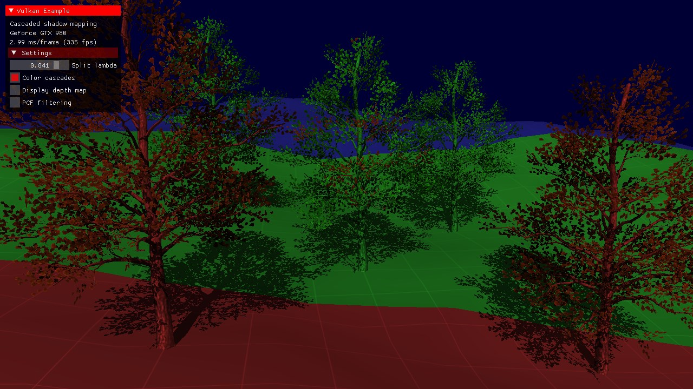
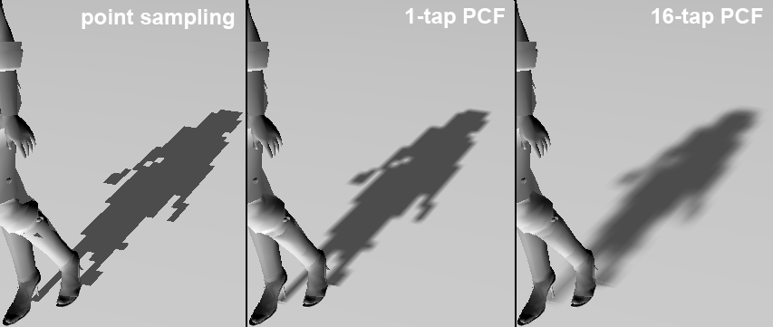
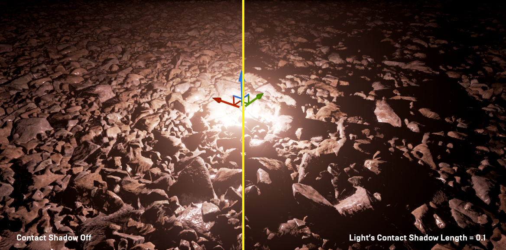

# Cascaded Shadow Maps + PCF 软阴影 + Contact Shadows

## 项目概述

实时阴影是提升场景立体感和空间感知的核心技术。本项目在现有 PBR 渲染器中实现 **Cascaded Shadow Maps (CSM)** 方向光阴影系统，支持多级 cascade 覆盖近中远距离，并通过 **Percentage-Closer Filtering (PCF)** 实现软阴影效果。此外，通过 **Contact Shadows** 在屏幕空间补充 shadow map 无法覆盖的小尺度接触阴影。

CSM 将相机视锥体按深度分割为多个区间，每个区间独立生成一张 shadow map，使近处阴影保持高分辨率的同时远处阴影覆盖更大范围。PCF 通过多次采样 shadow map 并对比较结果取平均，模拟软阴影的渐变边缘。Contact Shadows 通过在屏幕空间沿光线方向对 depth buffer 进行 ray marching，检测近距离遮挡，补充物体贴地处的精细阴影。

## 实现计划

1. **Shadow Map 资源与 Shadow Pass**：创建多层深度纹理，新增 shadow pass 将场景从光源视角渲染为深度图
2. **Cascade 分割与投影**：实现 PSSM 分割策略，将相机视锥体按深度划分为多个 cascade，每个 cascade 独立计算光空间投影
3. **Texel Snapping**：消除相机移动时的阴影边缘闪烁
4. **Bias 系统**：多重 bias 策略互补，消除 shadow acne 和 peter panning
5. **PCF 软阴影**：多次采样取平均实现可配置的软阴影
6. **Cascade Blend + Distance Fade**：消除 cascade 边界硬切换，最远处平滑淡出
7. **Per-cascade 剔除**：每个 cascade 独立视锥剔除，减少绘制量
8. **Alpha Mask 阴影**：支持半透明遮罩物体（树叶、栅栏）的镂空阴影
9. **Contact Shadows**：屏幕空间 ray marching 检测近距离遮挡，与 CSM 阴影合并，补充小尺度接触阴影
10. **运行时配置与可视化**：DebugUI 调参 + cascade 覆盖区域颜色可视化

## 预期效果

室外场景中方向光产生清晰的阴影投射：近处阴影细节丰富（高 texel density），远处阴影覆盖完整（大范围 cascade）。PCF 使阴影边缘呈现柔和的过渡，而非锯齿状硬边。相机移动时阴影稳定无闪烁。Alpha mask 物体（如树叶、栅栏）正确投射带镂空的阴影。物体贴地处出现精细的接触阴影（Contact Shadows），增强接触感和重量感。

## 参考文献

- Zhang, F., Sun, H., Xu, L., & Lun, L. K. (2006). [Parallel-Split Shadow Maps for Large-scale Virtual Environments](https://dl.acm.org/doi/10.1145/1128923.1128975). *ACM VRCIA 2006*.
- Reeves, W. T., Salesin, D. H., & Cook, R. L. (1987). [Rendering Antialiased Shadows with Depth Maps](https://dl.acm.org/doi/10.1145/37401.37435). *ACM SIGGRAPH Computer Graphics*, 21(4), 283–291.
- Microsoft. [Cascaded Shadow Maps](https://learn.microsoft.com/en-us/windows/win32/dxtecharts/cascaded-shadow-maps). *Microsoft Learn — DirectX Technical Articles*.
- Epic Games. [Contact Shadows in Unreal Engine](https://dev.epicgames.com/documentation/en-us/unreal-engine/contact-shadows-in-unreal-engine). *Unreal Engine Documentation*.
- McGuire, M., & Mara, M. (2014). [Efficient GPU Screen-Space Ray Tracing](http://casual-effects.blogspot.com/2014/08/screen-space-ray-tracing.html). *Journal of Computer Graphics Techniques (JCGT)*, 3(4).
