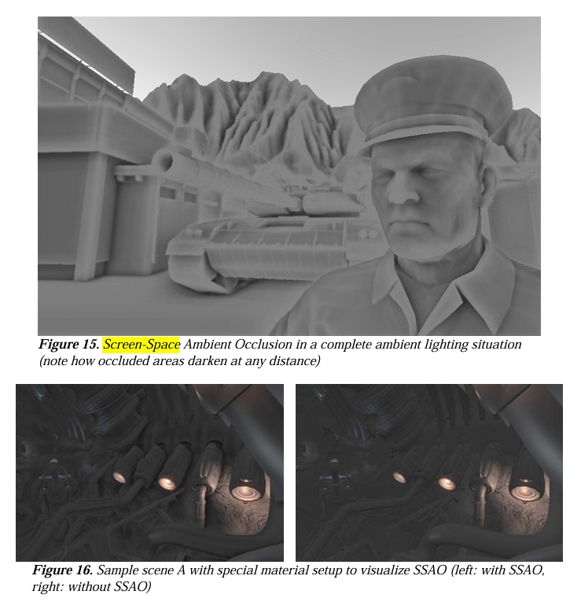

# Screen-Space Ambient Occlusion (SSAO)

## 项目概述

环境光遮蔽（Ambient Occlusion）模拟光线在物体凹陷处和接缝处被遮挡的效果，为场景增添空间层次感和深度信息。本项目实现 **Screen-Space Ambient Occlusion (SSAO)**，在屏幕空间利用 depth buffer 和 normal buffer 近似计算每个像素的遮蔽程度，并通过 **temporal filtering** 在时间域上稳定结果、降低采样噪声。

SSAO 是一种被广泛应用于现代游戏引擎的技术，其优势在于与场景几何复杂度无关，性能开销可预测。

## 实现计划

1. **SSAO Pass**：新增屏幕空间 pass，利用 depth buffer 和 normal buffer 计算每个像素的遮蔽程度，输出单通道 AO 纹理
2. **半球采样与噪声旋转**：在每个像素法线方向的半球内随机采样，使用噪声纹理旋转采样方向以低采样数获得高质量结果
3. **Temporal Filtering**：搭建 temporal 基础设施（历史 buffer + 相机 reprojection），将当前帧 AO 与历史帧混合以消除噪声，处理 disocclusion 情况
4. **Forward Pass 集成**：AO 结果乘以环境光项，为凹陷和接缝区域添加自然暗部
5. **DebugUI**：AO 半径、强度等参数可调，支持 AO-only 可视化模式

## 预期效果

物体接缝处、角落里、凹陷区域自然变暗，增强空间层次感。墙角、家具腿部、柱子底部等区域的遮蔽效果明显。Temporal filtering 消除单帧采样的随机噪声，画面稳定。相机快速移动时 disocclusion 区域短暂闪烁后迅速收敛。

## 参考文献

- Mittring, M. (2007). [Finding Next Gen – CryEngine 2](https://artis.inrialpes.fr/Membres/Olivier.Hoel/ssao/p97-mittring.pdf). *SIGGRAPH 2007 Course: Advanced Real-Time Rendering in 3D Graphics and Games*, Chapter 8.
