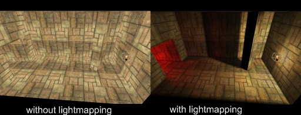
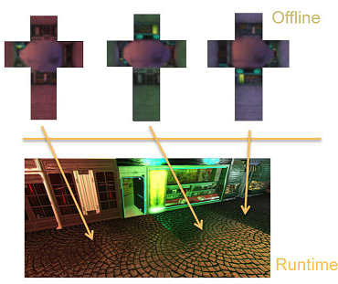

# Lightmap + Reflection Probes（预计算间接光照）

## 项目概述

直射光照只能呈现光源直接照亮的区域，而现实世界中光线会在表面间多次反弹——红色墙壁旁的白色物体被染上红色调（color bleeding），窗户的光线照进房间照亮远离光源的角落，光滑地板反射天花板和家具。本项目通过两种互补的预计算技术为静态场景提供完整的间接光照：

- **Lightmap**：离线烘焙间接漫反射光照，存储为纹理贴图，运行时通过 UV2 采样，提供 color bleeding 和柔和的间接照明
- **Reflection Probes**：在场景中放置采样点采集局部环境 cubemap，运行时通过 **Parallax-Corrected Cubemap** 视差校正算法，为光滑表面提供正确的局部环境反射

两者分别覆盖间接光照的漫反射和镜面反射分量，合在一起使室内场景从"只有直射光"的生硬画面变为光照完整、反射正确的写实场景。

## 实现计划

1. **Lightmap 加载**：加载预烘焙的 lightmap 纹理，支持 HDR 编码格式的解码
2. **UV2 坐标与材质扩展**：从 glTF mesh 中提取 lightmap 专用 UV 坐标，材质系统新增 lightmap 索引
3. **Lightmap 集成**：在光照计算中采样 lightmap，将预计算的间接漫反射加入最终颜色
4. **Probe 数据与 Cubemap 加载**：定义 probe 数据结构，加载采集的 probe cubemap 并上传 GPU
5. **视差校正算法**：在 shader 中将反射向量与 probe 的代理 AABB 求交，校正 cubemap 采样方向
6. **Probe 选择与混合**：为每个像素选择影响它的 probe，影响范围边缘平滑过渡到全局 IBL
7. **Specular IBL 集成**：在 specular IBL 计算中用 probe cubemap 替代全局环境贴图
8. **DebugUI**：lightmap 强度调节、probe 位置/范围可视化、lightmap-only / probe-only 渲染模式

## 预期效果

室内场景中，原本完全黑暗的角落被间接光照亮，不同颜色的墙面向邻近物体投射色彩。光滑的室内地板正确反射天花板和家具，而非天空。金属物体反射附近的墙壁和窗户。整体氛围温暖自然，光照完整。

## 参考文献

- O'Donnell, Y. (2018). [Precomputed Global Illumination in Frostbite](https://media.contentapi.ea.com/content/dam/eacom/frostbite/files/gdc2018-precomputedgiobalilluminationinfrostbite.pdf). *Game Developers Conference (GDC) 2018*.
- Pettineo, M. (2012). [Radiosity, DX11 Style](https://therealmjp.github.io/posts/radiosity-dx11-style/). *Blog Post*.
- Lagarde, S., & Zanuttini, A. (2012). [Local Image-Based Lighting with Parallax-Corrected Cubemaps](https://dl.acm.org/doi/10.1145/2343045.2343094). *ACM SIGGRAPH 2012 Talks*. ([Slides](https://seblagarde.wordpress.com/2012/11/28/siggraph-2012-talk/))
- Lagarde, S., & Zanuttini, A. (2013). [Image-Based Lighting Approaches and Parallax-Corrected Cubemaps](https://seblagarde.wordpress.com/2012/09/29/image-based-lighting-approaches-and-parallax-corrected-cubemap/). *GPU Pro 4*, A K Peters/CRC Press.
