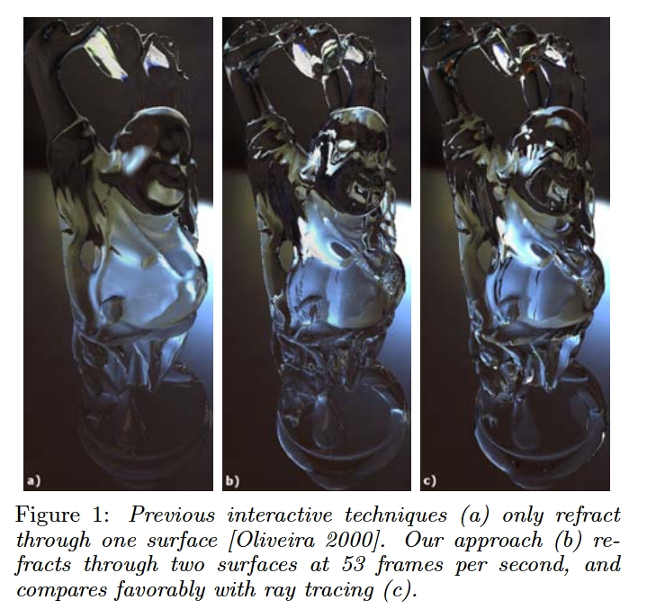

# 透明渲染 + 屏幕空间折射

## 项目概述

透明物体（玻璃窗、水面、半透明材质）的渲染需要将物体颜色与背景颜色混合。本项目实现 **Alpha Blending 透明渲染** + **屏幕空间折射**，使玻璃等透明物体不仅能正确混合颜色，还能产生光线穿过时的折射扭曲效果。

透明渲染的核心挑战在于正确的绘制顺序（back-to-front sorting）以及折射效果的实现。屏幕空间折射通过对已渲染的 HDR color buffer 进行偏移采样，以低成本模拟折射效果。

## 实现计划

1. **透明物体排序**：按物体到相机距离 back-to-front 排序，确保混合正确性
2. **Transparent Pass**：新增透明 forward pass，复用 PBR 光照代码，alpha blending 混合颜色
3. **屏幕空间折射**：拷贝不透明场景的 HDR color buffer 作为折射源，根据法线和折射率偏移 UV 采样，模拟透过透明物体看到的扭曲背景
4. **DebugUI**：折射率、折射强度等参数可调

## 预期效果

玻璃窗透过背后的场景，产生轻微的折射扭曲。不同 IOR 的透明材质折射程度不同。透明物体正确混合颜色——多层半透明物体叠加时效果自然。粗糙玻璃（如磨砂玻璃）产生模糊的折射。

## 参考文献

- Wyman, C. (2005). [An Approximate Image-Space Approach for Interactive Refraction](https://dl.acm.org/doi/10.1145/1073204.1073310). *ACM SIGGRAPH 2005*.
